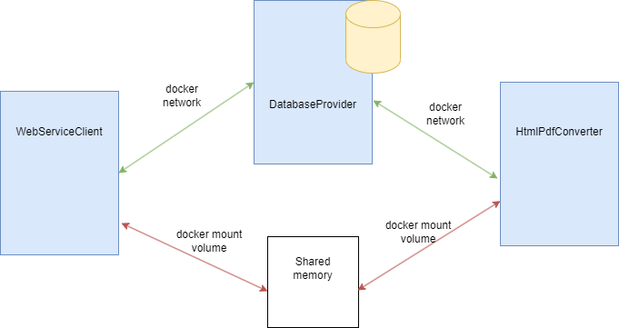

# Architecture 
Web service consists of three components: client, database, and converter. The reason for this applied architecture is to make the web service to be scalable.
If we want to do vertical scalability, microservice architecture is also applicable in this case.
(Need to increase convert resource - add additional converter container; Need to increase the count of clients - add additional client container)
Every component is a docker container (microservices), which allows to separate of different tasks between components (for better development and testing I created a docker-compose file).
The figure below demonstrates the simple architecture of this web service. Let's describe every component.

## WebServiceClient
Web service client is a blazor service application, which allows solving basic frontend tasks through C# code.
To prevent having identical Html filenames application adds a unique GUID (short version of it) to HTML's filename. After uploading client waits until a pdf file is created, and then allows the user to download the pdf file.

## DatabaseProvider
DatabaseProvider is a "queue" for clients and converters. A client sends to databaseprovider that it has a new file for converting. The converter sees that a new file is uploaded and starts converting.
There are 2 tables in the database: documents (common pool for queue) and queues (current progress of every converter);
There are 4 API commands:
- post a new document for converting
- put the document in progress
- get the progress of document
- delete from the queue
To prevent concurrent executing API requests every SQL command has a transaction.

## HtmlPdfConverter
Every HtmlPdfConverter has an ID to prevent concurrent taking from the queue. After running a converter application it looks for a document in progress for it 
(for instance, the application took the document, but didn't convert it, because IIS is restarted). If there is a document in progress, then the application tries to convert it.
If there isn't - the application takes a new document from the queue. Converter every 5 seconds checks if there is a job for it.

**Important:** Docker container doesn't have a chromium browser by default. Before running, there should be executed command:
`apt update && apt install -y chromium`

## Demo
